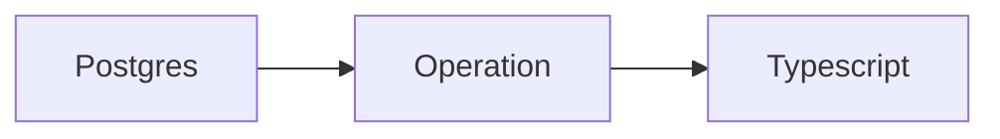
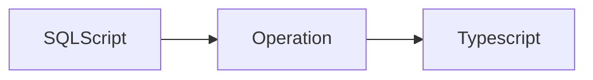

# Operations

An Operation is a single action to take against the database.

Creating operations is an intermediate step before generation, starting
with the Postgres catalog.

And then from raw SQL scripts.

